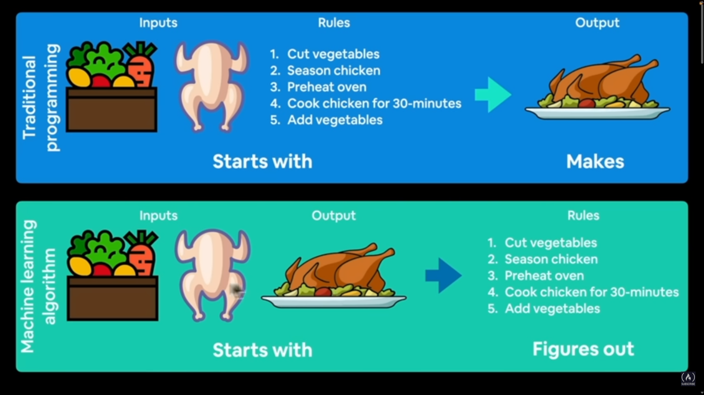
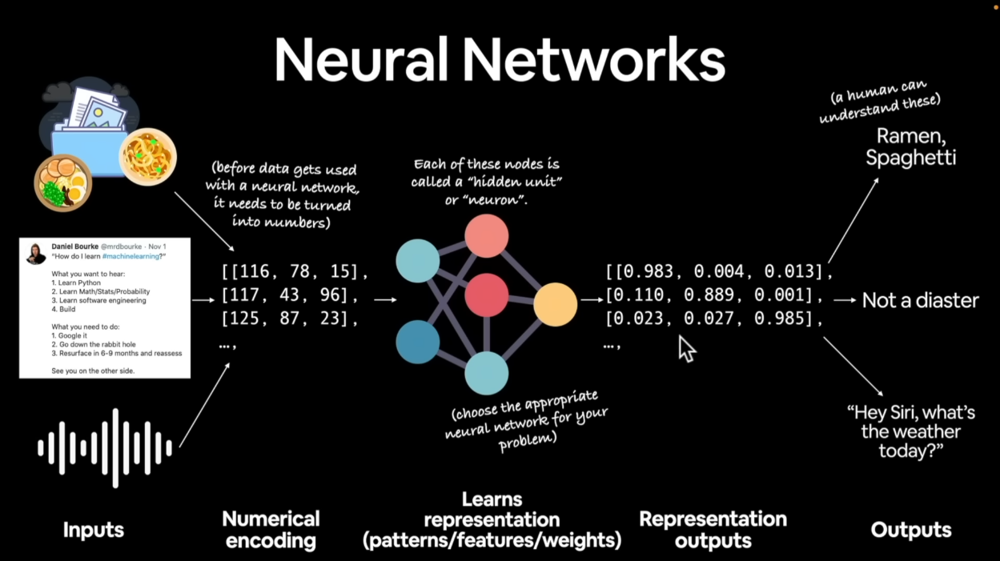
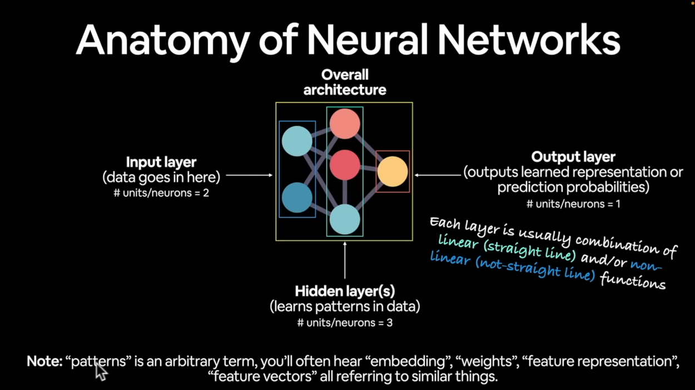
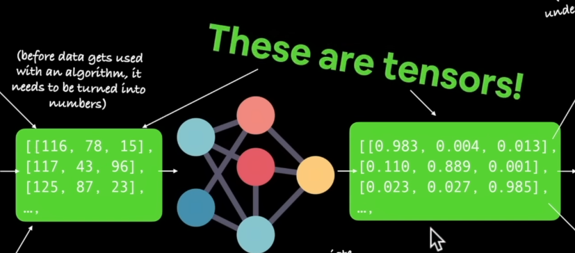
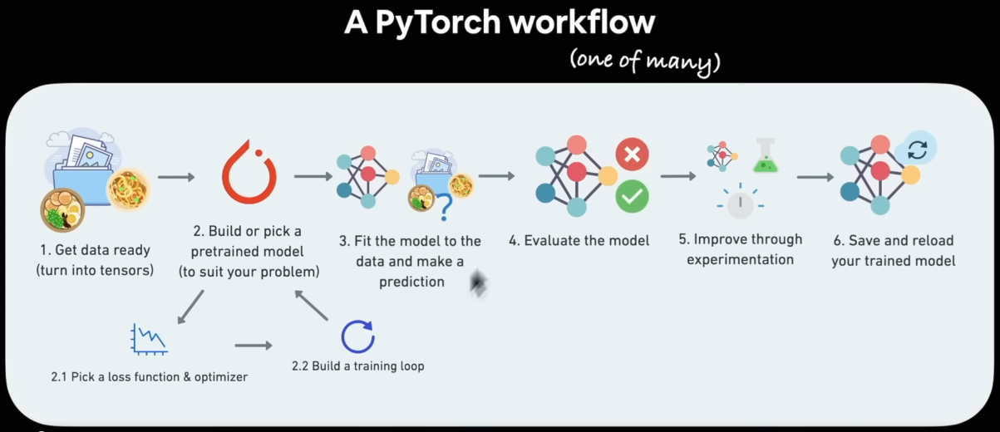

# PyTorch
PyTorch for Deep Learning &amp; Machine Learning personal studies.

Source: [PyTorch for Deep Learning & Machine Learning – Full Course](https://www.youtube.com/watch?v=V_xro1bcAuA) by freeCodeCamp.org.

## What is deep learning?
Machine learning is turning things (data) into numbers and **finding patterns** in those numbers.
The computer does this part (finding patterns). How? Code & math.

### Machine Learning VS. Deep Learning

- Machine Learning: Structured data you may use algorithm, gradient boosted machine, random forest, tree based algorithm (dmlc XGBoost).
- Deep Learning: Unstructured data you may use algorithm, neural network.

**Common algorithm for structured data (Machine Learning):**
- Random forest
- Gradient boosted models
- Naive Bayes
- Nearest neighbour
- Support vector machine
- ...many more

_(since the advent of deep learning these are often referred to as "shallow algorithms")_

**Common algorithm for unstructured data (Deep Learning):**
- Neural networks
- Fully connected neural network
- Convolutional neural network
- Recurrent neural network
- Transformer
- ...many more

(**depending** how you represent your problem, many algorithms can be used for both)

### Traditional Programming VS. Machine Learning Algorithm

## Why use machine learning (or deep learning)?
**Good reason:** ~~Why not?~~ 
 
**Better reason:** For a complex problem, can you think of all the rules? (probably not)

"If you can build a **simple rule-based** (maybe not very simple...) system that doesn't require machine learning, do that."
 
-- A wise software engineer... (actually rule 1 of <u>Google's Machine Learning Handbook</u>)

## What deep learning is good for?
- **Problems with long lists of rules**--when the traditional approach fails, machine learning/deep learning may help.
- **Continually changing environments**--deep learning can adapt ('learn') to new scenarios.
- **Discovering insights within large collection of data**--can you imagine trying to hand-craft rules for what 101 different kinds of food look like?

## What deep learning (typically) is not good for?
- **When you need explainability**--the patterns learned by a deep learning model are typically uninterpretable by a human.
- **When the traditional approach is a better option**--if you can accomplish what you need with a simple rule-based system.
- **When errors are unacceptable**--since the outputs of deep learning model aren't always predictable.
- **When you don't have much data**--deep learning models usually require a fairly large amount of data to produce great results. _(though we'll see how to get great results without huge amounts of data)_

## What are neural networks?

## Anatomy of Neural Networks

## Types of Learning
- Supervised Learning
- Unsupervised & Self-supervised Learning
- Transfer Learning

## What is deep learning actually used for?
"_I think you can use ML for literally anything as long as you can convert it into numbers and program it to find patterns. Literally it could be anything any input or output from the universe_" ~ Yashawi Kulshreshtha.

### Deep Learning Use Cases (some)
- **Recommendation**
- **Translation:** Sequence to sequence (seq2seq)
- **Speech recognition:** Sequence to sequence (seq2seq)
- **Computer Vision:** Classification/regression
- **Natural Language Processing (NLP):** Classification/regression

## What is PyTorch?
- Most popular research deep learning framework*
- Write fast deep learning code in Python (able to run on a GPU/many GPUs)
- Able to access many pre-built deep learning models (Torch Hub/<u>torchvision.models</u>)
- Whole stack: preprocess data, model data, deploy model in your application/cloud
- Originally designed and used in-house by Facebook/Meta (now open-source and used by companies such as Tesla, Microsoft, OpenAI)

## Why PyTorch?
- Research favourite
- "_With tools like Colab, Keras, TensorFlow, and PyTorch, virtually anyone can solve in a day, with no initial investment, problems that would have required an engineering team working for a quarter and $20k in hardware in 2014._" ~ François Chollet
- It's absolutely everywhere

## What is a GPU/TPU?
PyTorch leverages CUDA to enable you to run your machine learning code on NVIDIA GPUs.
- GPU (Graphics Processing Unit)
- TPU (Tensor Processing Unit)

## What is a tensor?
Tensors it could be almost any representation of numbers.

## What we're going to cover (broadly)
- Now:
  - PyTorch basics & fundamentals (dealing with tensors and tensor operations)
- Later:
  - Preprocessing data (getting it into tensors)
  - Building and using pretrained deep learning models
  - Fitting a model to the data (learning patterns)
  - Making predictions with a model (using patterns)
  - Evaluating model predictions
  - Saving and loading models
  - Using a trained model to make predictions on custom data

## How to approach this course
1. **Code along.** _Motto #1: if in doubt, run the code!_
2. **Explore and experiment.** _Motto #2: Experiment, experiment, experiment!_
3. **Visualize what you don't understand.** _Motto #3: visualize, visualize, visualize!_.
4. **Ask questions.** _(inluding the "dumbs" one)_.
5. **Do the exercises.**
6. **Share your work.**

## Resources
### This course:
- Course materials: https://github.com/mrdbourke/pytorch-deep-learning
- Course Q&A: https://github.com/mrdbourke/pytorch-deep-learning/discussions
- Course online book: https://learnpytorch.io

### All things PyTorch:
- PyTorch website & forums: https://pytorch.org